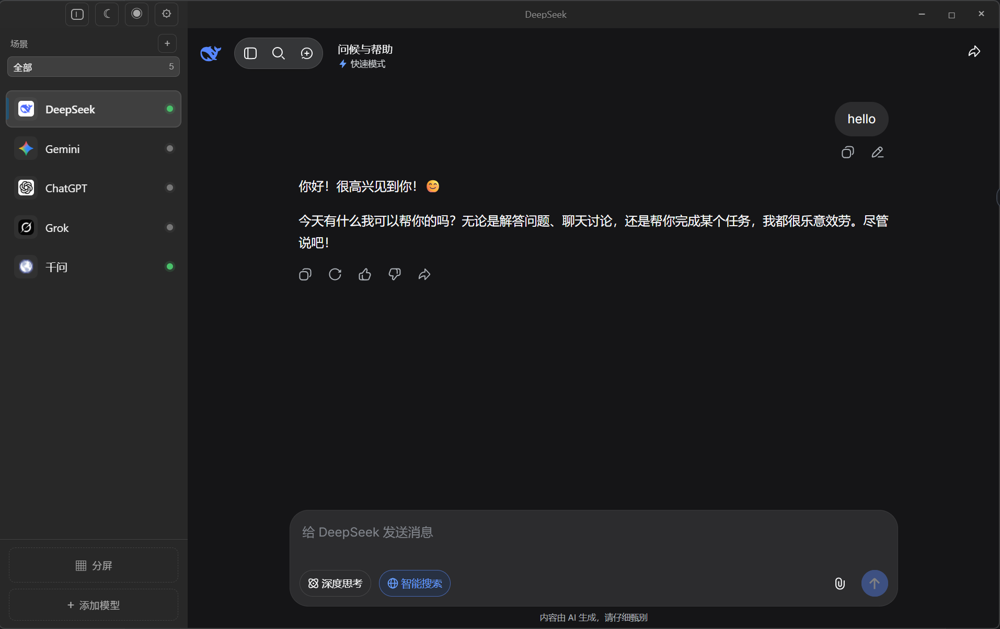
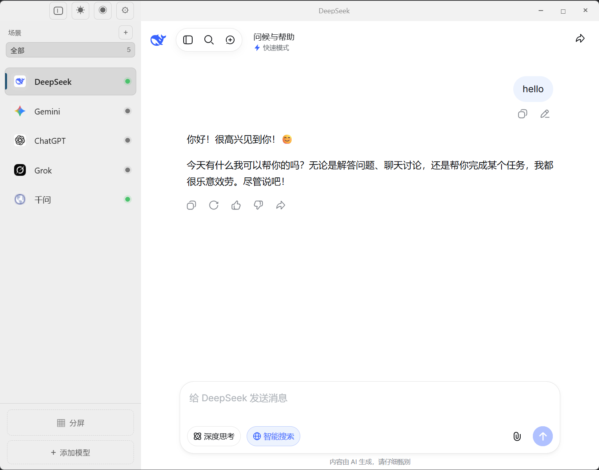
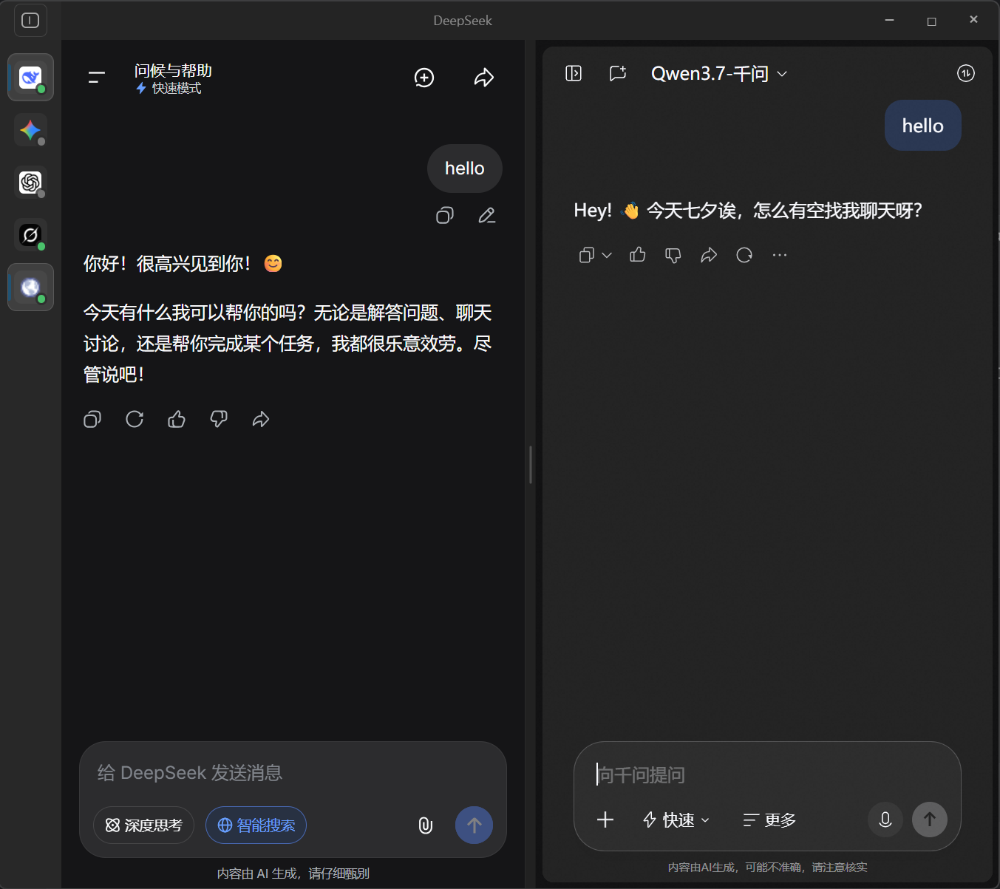
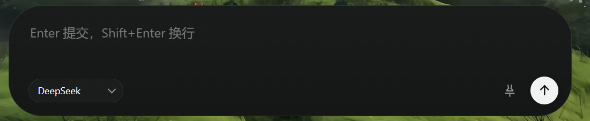
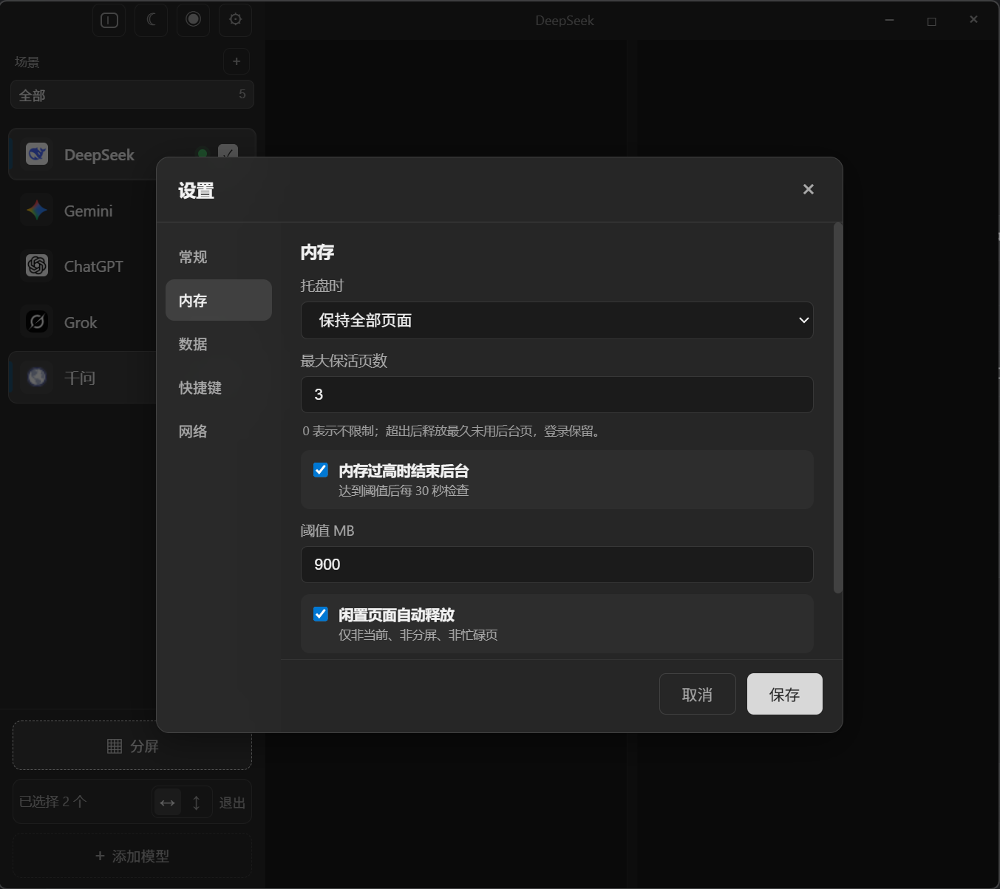
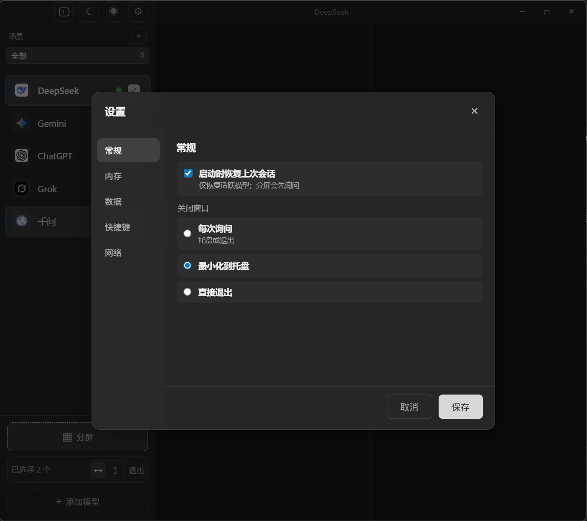
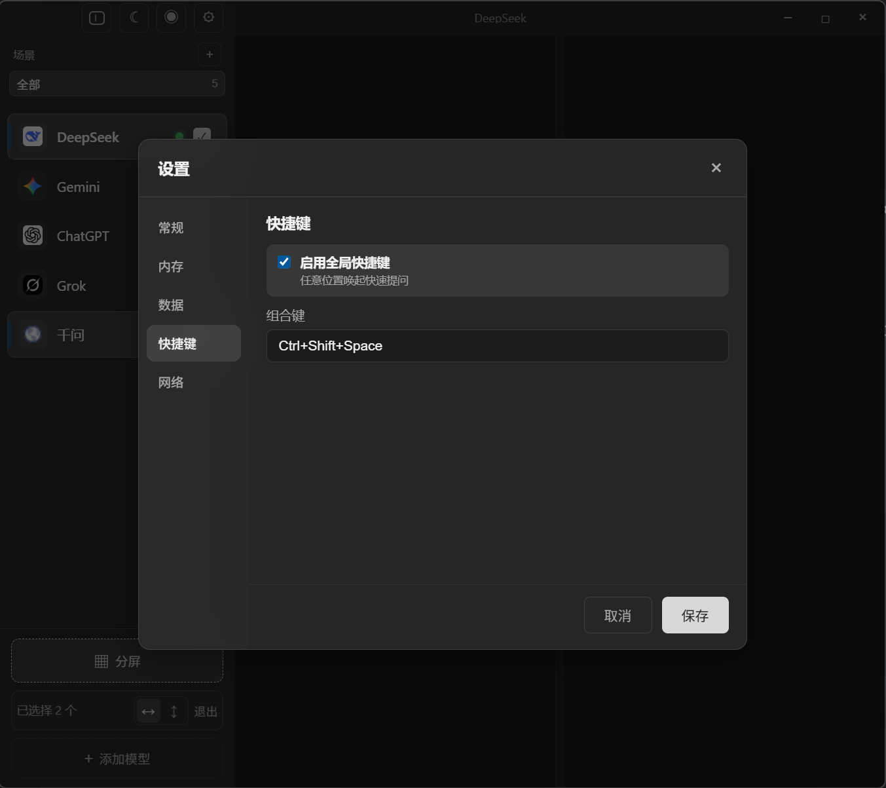

# AIchat

[](https://www.electronjs.org/)
[](./test)
[](./LICENSE)
[](https://github.com/Listencur/AIchat/releases/tag/v1.0.0)

> 一个 Electron 桌面窗口聚合多个 AI 网站。**独立会话、一键切换、分屏对比、快速提问**。

[下载 v1.0.0](https://github.com/Listencur/AIchat/releases/tag/v1.0.0) · [查看截图](#截图展示) · [架构说明](#架构概览)

---

## 这是什么？

AIchat 是一个 **Electron 桌面应用**，把多个 AI 网站（ChatGPT、Gemini、DeepSeek、千问、Grok 等）放到一个窗口里。每个网站都在自己独立的 Electron `Session` 中运行 —— **Cookie、LocalStorage、IndexedDB 完全隔离**，互不干扰。

适合每天都要和多个 AI 打交道的用户：不用在 5 个标签页之间来回切换，也不会出现「在 A 网站登出导致 B 网站的会话失效」的尴尬。

---

## 主要功能

### 1️⃣ 一窗口多 AI，侧边栏一键切换




**同一个窗口，主题任选** —— 暗黑适合长时间编码，明亮适合白天办公。左侧是模型列表，点击切换激活的网页。中间显示当前选中 AI 的完整网页界面，保留各家网站的全部原生能力（富文本、图片、代码高亮、文件上传、插件等）。

- 支持 **DeepSeek / Gemini / ChatGPT / Grok / 千问** 等已适配站点
- 任意其他 URL 可通过 **通用降级（generic-fill）** 加载 —— 只填入 prompt，不会自动按 Enter
- 会话独立：一个模型登出不影响其他模型

### 2️⃣ 分屏对比，2-3 路同时看



需要对比两个 AI 的回答？点底部的 **「分屏」**，再加一个模型就能左右对照。比例可拖拽调整。

- 多个模型同时活跃，回复独立显示
- 适合「同一个问题，让 A 和 B 各答一遍看差异」
- 支持横向 / 纵向布局

### 3️⃣ 快速提问窗口，全局热键秒呼



**任意位置** 按 `Ctrl + Shift + Space`（可自定义）召唤出独立的小窗：

- 在不打断当前 AI 对话的前提下快速发问
- 选择目标模型（一个或多个）
- 输入框提示 `Enter 提交，Shift+Enter 换行`
- 提交后自动隐藏，结果回到主窗口

### 4️⃣ 设置窗口：内存 / 常规 / 数据 / 快捷键 / 网络

设置窗口按 5 个分类组织，左侧导航，右侧详情。即使窗口不够高也只滚动右侧，分类不会跑掉。

#### 内存设置


- **托盘时**：保持全部页面 / 仅保留激活 / 释放所有
- **最大保活页数**：超出后释放最久未用的后台页（登录态保留）
- **内存过高时结束后台**：达到阈值后每 30 秒检查一次
- **闲置页面自动释放**：仅非当前、非分屏、非忙碌的页面会被回收

#### 常规设置


- **启动时恢复上次会话**（仅恢复活跃模型，分屏会先询问）
- **关闭窗口时**：每次询问 / 最小化到托盘 / 直接退出

#### 快捷键

- **启用全局快捷键**：任意位置唤起快速提问（无图，见下方说明）
- **组合键**：默认 `Ctrl + Shift + Space`，可自定义

#### 数据


- **清除缓存**：清除 HTTP 缓存、Cache Storage、代码缓存、可清理的 DNS 缓存 —— **保留 Cookie / LocalStorage / IndexedDB / 登录态**
- **清除登录状态**：清除所有模型的登录存储，并结束现有 View，所有模型都要重新登录

> ⚠️ 这两个按钮在 `保存` 之后才会生效，操作期间按钮禁用避免误触。

---

## 核心架构概览

```
electron/  主进程（生命周期、IPC、Session、持久化）
   |
   +-- model-store / session-manager / group-store
   +-- snapshot-service / memory-manager
   +-- view-manager (facade)
        +-- view-lifecycle / view-layout / view-reclaimer
        +-- prompt-injector
   +-- ipc-guard / state-store / model-policy
   +-- site-adapters/  站点适配器注册表
src/       渲染进程（侧边栏、快速提问、设置）
test/      单元测试（node:test，270 项）
data/      用户数据（models.json 不入库）
```

### 关键不变量

- **active / split / busy 视图永远不会被自动回收**
- 已销毁的 `WebContents` 再次 `executeJavaScript` 会直接被拒绝，快速提问目标已删除模型时返回 `{ ok: false, reason: 'view-not-loaded' }`
- `ensureView(modelId)` 同一模型同时只能有一个创建 Promise
- 删除模型：清理 partition、cookies、IndexedDB、localStorage、service workers、cache storage、WebSQL、auth cache、磁盘目录 —— 失败有日志，绝不留下半删状态

### IPC 契约（统一）

| 情况 | 返回格式 |
|---|---|
| 成功 | `{ ok: true, data }` 或明确业务对象 |
| 失败 | `{ ok: false, reason, message? }` |
| 列表接口失败 | `[]` |
| 状态接口失败 | 完整空结构 |
| 布尔命令失败 | `{ ok: false, reason }` |

---

## 快速开始

### 下载安装

前往 [Releases](https://github.com/Listencur/AIchat/releases/tag/v1.0.0) 下载 `AIchat-1.0.0-portable.exe`（约 89 MB，单文件便携版）。

### 从源码运行

```bash
git clone https://github.com/Listencur/AIchat.git
cd AIchat
npm install
npm start          # 启动
npm run dev        # 启动并打开 DevTools
npm test           # 运行 270 项测试
```

### 系统要求

- Windows 10/11 x64
- [Visual C++ Redistributable](https://learn.microsoft.com/en-us/cpp/windows/latest-supported-vc-redist)（Electron 42 依赖）

### 首次使用

1. 把 `data/models.example.json` 复制为 `data/models.json` 预置模型（如不需要新增模型可跳过）
2. 在 **设置 -> 数据** 中添加自己的模型（或编辑 `models.json`）
3. 在每个 AI 网站完成登录（独立会话，一次登录长期保留）

---

## 配置说明

### `data/models.json`

```json
{
  "configVersion": 1,
  "models": [
    {
      "id": "chatgpt",
      "name": "ChatGPT",
      "url": "https://chatgpt.com",
      "icon": "💬",
      "color": "#10a37f",
      "partition": "persist:chatgpt"
    }
  ]
}
```

| 字段 | 必填 | 说明 |
|---|---|---|
| `id` | ✅ | 唯一。Electron partition 从 `id` 派生 |
| `name` | ✅ | 侧边栏显示名 |
| `url` | ✅ | 起始 URL |
| `icon` | ❌ | emoji 或字符串，侧边栏图标 |
| `color` | ❌ | CSS 颜色，侧边栏主色 |
| `partition` | ❌ | 覆盖派生的 Electron partition |

### 启动参数

| 参数 | 说明 |
|---|---|
| `--dev` | 打开 DevTools |

---

## 进阶：扩展

### 添加新站点适配器

1. 在 `electron/site-adapters/<name>.js` 写一个 adapter：

```js
const ADAPTER_ID = 'my-site';
function matches(url) {
  return typeof url === 'string' && url.includes('mysite.example');
}
module.exports = {
  id: ADAPTER_ID,
  matches,
  prompt: {
    inputSelectors: ['textarea[aria-label="Ask"]'],
    sendSelectors:  ['button[aria-label="Send"]'],
    inputStrategy:  'native-value',
    sendStrategy:   'click',
  },
  capabilities: { canAutoSend: true, canFillPrompt: true },
};
```

2. 在 `electron/site-adapters/registry.js` 注册。
3. 在 `test/site-adapters.test.js` 加测试。
4. `npm test && npm start` 验证。

### 添加新 IPC 通道

1. 在对应模块实现 handler（不要堆在 `main.js`）
2. 在 `electron/preload.js` 暴露
3. 在 `test/ipc-contract.test.js` 文档化返回形状
4. `npm test`

### 添加新模块

- 使用依赖注入传入 `app / session / fs / path`
- 不直接调用 `mainWindow.webContents.send`，返回值由 `main.js` 统一通知 renderer
- 必须配套一个 `test/<module>.test.js`

---

## 测试

```bash
npm test
```

| 测试文件 | 覆盖范围 |
|---|---|
| `test/ipc-contract.test.js` | 每个 IPC 通道的成败格式 |
| `test/state-store.test.js` | 原子写入 + 防抖 |
| `test/model-store.test.js` | 模型 CRUD |
| `test/session-manager.test.js` | partition 清理、会话生命周期 |
| `test/group-store.test.js` | 分组 CRUD |
| `test/snapshot-service.test.js` | 快照持久化、同源校验 |
| `test/memory-manager.test.js` | watchdog + 回收通知 |
| `test/view-lifecycle.test.js` | ensure/destroy/busy/ready |
| `test/view-layout.test.js` | 单/分屏 bounds + 比例 |
| `test/prompt-injector.test.js` | prompt 注入 + 发送策略 |
| `test/view-reclaimer.test.js` | LRU + 闲置 + 保护 ID |
| `test/site-adapters.test.js` | 各站点适配器匹配 |
| `test/settings-normalize.test.js` | 设置架构 + 迁移 |
| `test/integration.test.js` | 跨模块流程 |
| `test/phase2-concurrency.test.js` | 快速提问并发 + busy 保护 |

**共 270 项测试**，全部通过。**无任何测试使用真实账号、Cookie 或 partition**。

---

## 隐私

**本仓库不包含任何个人数据**。

| 类别 | 排除方式 |
|---|---|
| 对话记录 | `会话记录*/`, `聊天记录*/` |
| 用户模型列表 | `data/models.json`（提交 `data/models.example.json` 作为模板） |
| 构建产物 | `*.exe`, `dist/`, `build/` |
| 依赖 | `node_modules/` |
| 日志 | `*.log`, `error.log` |
| 编辑器状态 | `.vscode/`, `.idea/`, `.DS_Store`, `Thumbs.db` |
| 内部计划 | `.opencode/` |

Electron `userData` 目录按模型存放 partition 数据 —— **永远不会被提交**。

---

## 故障排除

### 切换模型后页面一片白
分区 session 被清空过。在 **设置 -> 数据 -> 清除登录状态**（或重新登录）即可。

### 启动报错 `require failed: electron`
在非 Electron 上下文执行了脚本。运行时用 `npm start`，测试用 `npm test`。

### 便携版在别的机器上启动失败
目标机器大概率需要 [Visual C++ Redistributable](https://learn.microsoft.com/en-us/cpp/windows/latest-supported-vc-redist)。

### `git pull` 后 `data/models.json` 没了
那是预期行为 —— 该文件在 `.gitignore` 中。从 `data/models.example.json` 恢复。

### 某个站点突然坏掉（DOM 改版）
更新 `electron/site-adapters/<site>.js` 里的 `inputSelectors` / `sendSelectors`。如果不确定，**降到 generic-fill** —— 只填入 prompt，不自动按 Enter。

---

## 贡献

欢迎 PR。在动手之前：

1. `npm test` 确保 270 项全过
2. 改过的文件都要过 `node --check`
3. Windows 下跑一遍 `scripts/verify.ps1`
4. 新代码必须有测试覆盖 —— 没有测试的公开函数是高风险回归点
5. 不要提交真实 cookie / 对话记录

站点 selector 不稳定时优先用 `generic-fill` 而不是写死 selector。**除非 adapter 明确声明 `canAutoSend: true`，主进程永远不模拟 Enter**。

---

## 项目结构

```
.
|-- electron/                  主进程（已模块化）
|   |-- main.js                IPC handlers（~925 行）
|   |-- view-manager.js        facade
|   |-- view-lifecycle.js
|   |-- view-layout.js
|   |-- view-reclaimer.js
|   |-- prompt-injector.js
|   |-- model-store.js
|   |-- session-manager.js
|   |-- snapshot-service.js
|   |-- memory-manager.js
|   |-- group-store.js
|   |-- ipc-guard.js
|   |-- state-store.js
|   |-- model-policy.js
|   |-- settings-normalize.js
|   \-- site-adapters/
|       |-- registry.js
|       |-- chatgpt.js / deepseek.js / gemini.js / qwen.js / grok.js
|       \-- generic-fill.js
|
|-- src/                       渲染端（侧边栏、快速提问、设置）
|-- test/                      270 项 node:test
|-- scripts/verify.ps1         发布前验证（Windows）
|-- docs/images/               README 截图
|-- data/models.example.json
|-- assets/                    图标资源
|-- package.json
|-- LICENSE                    MIT
\-- README.md                  本文件
```

---

## 致谢

由 v1.0.0 发布构建。详细变更历史参见 [commits](https://github.com/Listencur/AIchat/commits/master)。

---

## License

[MIT](./LICENSE)
